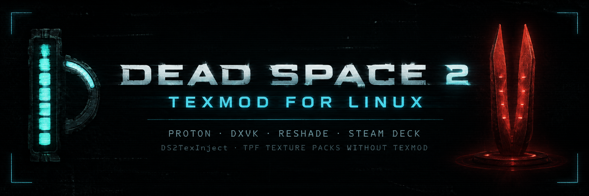

<p align="center"></p>

<h1 align="center">Dead Space 2 TexMod for Linux</h1>

<p align="center"><b>Load TexMod / uMod texture packs (<code>.tpf</code>) in Dead Space 2 on Linux. 4K suits, HD weapons and more.</b><br>
Steam · Proton / GE-Proton · DXVK · ReShade · Steam Deck</p>

<p align="center">
  
  
  
  
</p>

<p align="center"><i>"Make us whole."</i> Your RIG, now in 4K.</p>

<p align="center">🇧🇷 <b><a href="README.pt-BR.md">Leia em português →</a></b></p>

---

## What is this?

Dead Space 2 has great HD texture mods: 4K suits, weapons, and more. They come as `.tpf` files made for **TexMod** or **uMod**.

**TexMod and uMod don't work on Linux.** DS2TexInject replaces them. It is a small plugin that runs inside the game, finds the textures your packs replace, and swaps them in. Your existing `.tpf` files work as they are.

---

## Quick start

| Step | What to do |
|:---:|---|
| 1 | Install an **ASI loader**. **MarkerPatch** is recommended. |
| 2 | Add a **Steam launch option**. |
| 3 | Put your **`.tpf` packs** in a `texmod` folder. |
| 4 | Run **`./install.sh`** from this repo. |
| 5 | **Play.** Press **F10** to compare before and after. |

Each step is explained in detail below.

---

## Step 1: Install an ASI loader

DS2TexInject is an `.asi` plugin. It doesn't run by itself: something has to load it into the game. That is an **ASI loader**, and you need **one** of these two:

| | Option | Why pick it |
|:---:|---|---|
| ⭐ | **MarkerPatch** (recommended) | Loads the plugin **and** fixes many Dead Space 2 bugs: high FPS physics, VSync locked to 30 FPS, crashes on CPUs with many cores, raw mouse input, and more. |
| | **Ultimate ASI Loader** | Only loads the plugin. Use it if you don't want MarkerPatch. |

**MarkerPatch (recommended):**

<a href="https://github.com/Wemino/MarkerPatch/releases"></a>

Extract it into the game folder, next to `deadspace2.exe`. You should end up with `dinput8.dll` and `MarkerPatch.ini` there.

**Or Ultimate ASI Loader:**

<a href="https://github.com/ThirteenAG/Ultimate-ASI-Loader/releases"></a>

Get the **Win32** (32-bit) version and put its `dinput8.dll` in the game folder, next to `deadspace2.exe`.

> **Where is the game folder?** In Steam, right-click **Dead Space 2** → **Manage** → **Browse local files**.
> It is usually `~/.local/share/Steam/steamapps/common/Dead Space 2`.

## Step 2: Add the Steam launch option

Proton ignores DLLs placed in the game folder unless you tell it to load them.

1. In Steam, right-click **Dead Space 2** → **Properties** → **General**.
2. Paste one of these into **Launch Options**:

**Without ReShade:**
```
WINEDLLOVERRIDES="dinput8=n,b" %command%
```

**With ReShade** (your game folder has a `d3d9.dll`):
```
WINEDLLOVERRIDES="d3d9,dinput8=n,b" %command%
```

## Step 3: Get the texture packs

The texture packs are **not included** in this repository. They belong to their authors, so download them from the original pages.

These packs were tested and work:

#### 🟢 2K-4K Isaac Suits and Face

Isaac's suits and face in 2K and 4K, plus sharper weapons.

<a href="https://www.nexusmods.com/deadspace2/mods/82"></a>

```
1-4KMainSuitsnew.tpf
2Kaio.tpf
```

#### 🔴 Return to Titan

Lore-friendly skins for suits, weapons and interactables (lockers, supply boxes, node containers).

<a href="https://www.nexusmods.com/deadspace2/mods/97"></a> <a href="https://www.nexusmods.com/deadspace2/mods/40"></a>

```
1WEP_RTTn.tpf
3INTERACTABLES_RTTn.tpf    4INTERACTABLES_RTTn.tpf    5INTERACTABLES_RTTn.tpf
6INTERACTABLES_RTT.tpf     7INTERACTABLES_RTT.tpf     8INTERACTABLES_RTT.tpf
9INTERACTABLES_RTT.tpf
```

Any other Dead Space 2 `.tpf` pack should work too.

Create a folder named **`texmod`** inside the game folder and put all the `.tpf` files there:

```
Dead Space 2/
├── deadspace2.exe
├── dinput8.dll            ← ASI loader (MarkerPatch or Ultimate ASI Loader)
└── texmod/
    ├── 1-4KMainSuitsnew.tpf
    ├── 2Kaio.tpf
    └── ...
```

## Step 4: Install DS2TexInject

Open a terminal and run:

```sh
git clone https://github.com/sidnei-almeida/dead-space-2-texmod-linux
cd dead-space-2-texmod-linux
./install.sh
```

The installer does everything for you:

- finds the Dead Space 2 folder in your Steam libraries,
- compiles the plugin (the first time, it downloads a compiler; no `sudo` needed),
- copies the plugin to `Dead Space 2/plugins/`,
- unpacks and checks every texture in your `.tpf` packs.

If the game folder isn't found automatically, give it the path:

```sh
./install.sh "/path/to/Dead Space 2"
```

At the end you should see:

```
396 texturas unicas (665 MB) em .../texmod/_cache
Nenhuma textura quebrada encontrada.
```

The installer's messages are in Portuguese. The last line means *"No broken textures found."*

<details>
<summary><b>Manual install (no compiling)</b></summary>

1. Download `DS2TexInject.asi` and `DS2TexInject.ini`:

   <a href="https://github.com/sidnei-almeida/dead-space-2-texmod-linux/releases"></a>

2. Put `DS2TexInject.asi` in `Dead Space 2/plugins/`. Create the `plugins` folder if it doesn't exist.
3. Put `DS2TexInject.ini` in `Dead Space 2/`.
4. Unpack your textures:
   ```sh
   python3 ds2tex.py "/path/to/Dead Space 2/texmod"
   ```
</details>

## Step 5: Play

Launch Dead Space 2 from Steam as usual.

- Press **F10** in-game to turn the new textures **on and off**, so you can see the difference.
- To check that it is working, open `Dead Space 2/DS2TexInject.log`. Each `MATCH` line is a texture being replaced.

Textures are swapped as they appear on screen. Suits and weapons show up once you get them in the game.

---

## Recommended extras (optional)

None of this is needed for the texture mod. These are extras I personally use and like.

### ReShade, installed with LeShade

[ReShade](https://reshade.me) adds post-processing effects such as color grading and sharpening. On Linux, the easiest way to install it is **LeShade**, a ReShade manager with a graphical interface:

<a href="https://github.com/Ishidawg/LeShade"></a>

1. Install LeShade and open it.
2. Add Dead Space 2 by pointing it to `deadspace2.exe`.
3. Choose **DirectX 9** and install. Also install the shader packages listed below.
4. Use the Steam launch option for ReShade from [Step 2](#step-2-add-the-steam-launch-option).

In-game, the ReShade menu opens with **Home**. MarkerPatch also uses Home for its achievement list, so you can change ReShade's key in its settings if you want.

### Sprawl Noir: my ReShade preset

**Sprawl Noir** is a personal preset I use with Dead Space 2. It is based on another community preset that I tuned to my taste:

- Horror over action: a cold, sickly green-gray tone, like the Sprawl's stations.
- Desaturated colors and deeper shadows, so the RIG's blue and the red warnings stand out in the dark.
- Vignette and light film grain for a claustrophobic feel.
- Soft bloom, light sharpening and SMAA anti-aliasing.
- No ambient occlusion, so it is light on the GPU.

<a href="https://github.com/sidnei-almeida/dead-space-2-texmod-linux/blob/main/reshade/Sprawl%20Noir.ini"></a>

1. Copy `reshade/Sprawl Noir.ini` into the game folder.
2. In-game, press **Home**, open the preset list at the top and pick **Sprawl Noir**.

It uses these shaders. Install their packages in LeShade (or ReShade's installer) if any of them show up in red:

| Shaders | Package |
|---|---|
| `LUT.fx`, `Colourfulness.fx`, `AmbientLight.fx` | Standard / legacy ReShade shaders |
| `SMAA.fx`, `LiftGammaGain.fx`, `Sepia.fx`, `Curves.fx`, `Tonemap.fx`, `Levels.fx`, `LumaSharpen.fx`, `Vignette.fx`, `FilmGrain.fx` | SweetFX |
| `Artificial Lighting MLUT.fx`, `Atmospheric Film Affinity Presets MLUT.fx` | MLUT |

Everything is easy to adjust in the ReShade menu if something is too strong for your screen.

---

## Adding or removing packs

1. Add or delete `.tpf` files in `Dead Space 2/texmod/`.
2. Run this again (it rebuilds `texmod/_cache/` from scratch, so don't put your own files there):
   ```sh
   python3 ds2tex.py "/path/to/Dead Space 2/texmod"
   ```

**When two packs change the same texture,** the pack whose name comes first alphabetically wins. To choose the order yourself, create `texmod/load_order.txt` with one file name per line, most important first.

## Settings: `DS2TexInject.ini`

The file is in the game folder. You can open it with any text editor.

| Setting | Default | What it does |
|---|---|---|
| `Enabled` | `1` | `0` turns texture replacement off. |
| `ToggleKey` | `0x79` | Key that turns the textures on and off. `0x79` is **F10**. |
| `Pool` | `managed` | Change to `default` (experimental) if the game crashes with many 4K packs. It uses less memory. |
| `LogHashes` | `0` | `1` logs every texture the game loads. Useful for debugging. |
| `DumpTextures` | `0` | `1` saves the game's original textures to `texmod/_dump/`. Useful for making your own packs. |
| `TextureDir` | `texmod\_cache` | Where the unpacked textures are. |

---

## Troubleshooting

| Problem | Solution |
|---|---|
| **No `DS2TexInject.log` file appears** | The plugin isn't loading. Check that `dinput8.dll` (your ASI loader) is in the game folder, that `plugins/DS2TexInject.asi` exists, and that the launch option from Step 2 is set. |
| **The log has no `MATCH` lines** | Make sure you ran `ds2tex.py` and that `texmod/_cache/` has files in it. Also play a bit: suits and weapons only appear later in the game. |
| **The game crashes after playing a while** | Dead Space 2 is a 32-bit game and can run out of memory with many 4K textures. Set `Pool=default` in `DS2TexInject.ini`, or remove some packs. |
| **Edges still look jagged far away** | Some of it is the 2011 engine (thin poles, cables, grates). Rendering at a higher resolution helps: in the gamescope launch option, use 1.5x or 2x your screen size in `-w`/`-h` (for example `-w 5160 -h 2160` on a 3440x1440 screen) and set the same resolution in the game's video options. |
| **A texture looks wrong** | Press **F10** to confirm the pack causes it, then open an issue and say which pack it is. |
| **Something else** | Open an issue (button below) and attach `DS2TexInject.log`. |

<p align="center"><a href="https://github.com/sidnei-almeida/dead-space-2-texmod-linux/issues"></a></p>

---

## How it works

You don't need this section to use the mod.

**Why TexMod doesn't work on Linux:**

- TexMod and uMod inject themselves using Windows tricks that Wine doesn't support.
- They also need to replace `d3d9.dll`, a slot that ReShade and DXVK already use.
- The game's `.exe` is also wrapped in EA's DRM.

**What DS2TexInject does instead:**

1. The ASI loader (MarkerPatch or Ultimate ASI Loader) loads `DS2TexInject.asi` when the game starts.
2. The plugin hooks `Direct3DCreate9` inside whichever `d3d9.dll` the game uses (ReShade or DXVK). From there it hooks the Direct3D 9 device and texture methods.
3. When the game uploads a texture, the plugin computes the same **CRC32 hash TexMod uses** (on the top mip level).
4. If `texmod/_cache/0x<hash>.dds` (or `.png` / `.bmp`) exists, the plugin loads it and draws it instead of the original. Replacements are loaded only when needed and freed when the game stops using them.
5. Many packs ship DDS files **without mipmaps**, which makes textures shimmer and look jagged from a distance. The plugin generates the missing mipmaps the first time it loads such a file and saves the fixed file back to `texmod/_cache/`.

**What `ds2tex.py` does:**

A `.tpf` file is a zip archive, XOR-encoded and protected with TexMod's fixed password. `ds2tex.py` decodes it, checks every texture (format, size, damaged files), and writes them to `texmod/_cache/` named by hash.

**Building yourself:**

```sh
./build.sh      # creates dist/DS2TexInject.asi
```

It uses `i686-w64-mingw32-g++` if installed. If not, it downloads [llvm-mingw](https://github.com/mstorsjo/llvm-mingw) into `~/.local/opt`. All the code is in `src/ds2texinject.cpp`.

---

## Credits

- **Texture packs:** their respective authors on [Nexus Mods](https://www.nexusmods.com/deadspace2).
- **[MarkerPatch](https://github.com/Wemino/MarkerPatch)** by Wemino and **[Ultimate ASI Loader](https://github.com/ThirteenAG/Ultimate-ASI-Loader)** by ThirteenAG, which load the plugin.
- Hash compatibility follows the behavior of **TexMod** and **[uMod](https://code.google.com/archive/p/texmod/)**.

**Tested on:** Arch Linux, GE-Proton 11, DXVK, ReShade 6.8, MarkerPatch.

## License

[MIT](LICENSE). The texture packs are not part of this project and belong to their authors.
